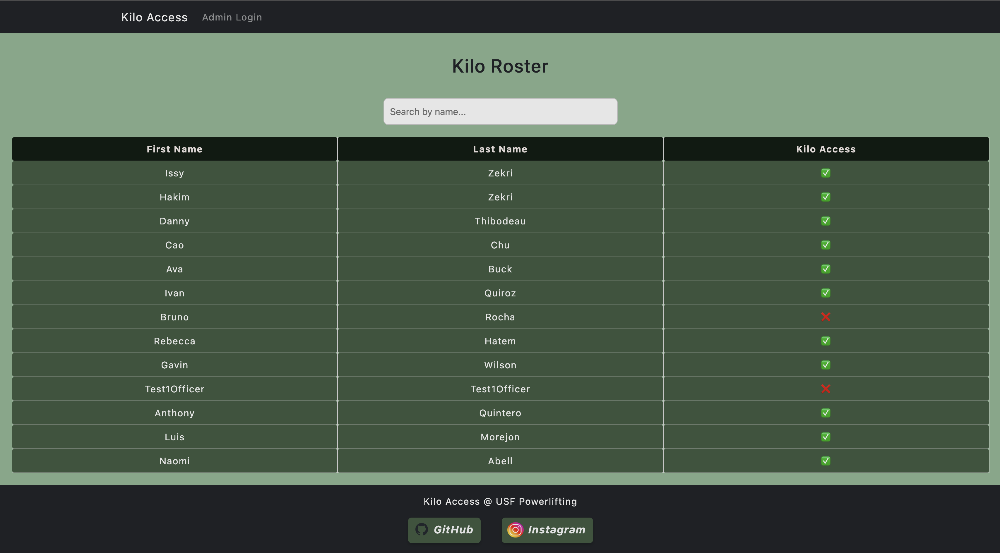

# 🏋️ USF Powerlifting Club Management System 🐂

A full-stack membership management system built for the University of South Florida Powerlifting Club, designed to securely manage equipment access and streamline officer administration.
This platform provides:

## How it's made
**Technology**: Python (Flask), TypeScript (React), Docker, PostgreSQL  
**Deployment**: Render (Backend), Vercel (Frontend), Supabase (Database)

The _USF Powerlifting Club_ Kilo Access web application is built to manage athlete access to over **$20,000 worth of specialized powerlifting equipment** at the Recreation & Wellness Center on the USF Tampa campus. The system empowers club officers (administrators) with secure authentication and role-based privileges, enabling them to seamlessly create, edit, and remove both athlete and administrator accounts. This design ensures smooth, autonomous management of access control, streamlining operations while maintaining accountability. 

## Optimizations & Improvements
- Database Migration: In progress—transitioning from Render’s database to Supabase for free, reliable, and permanent storage (500MB with unlimited API requests).
- QR Code Integration: Implementing downloadable, scannable QR codes linked to each athlete’s profile for use on physical athlete badges.
- Future Enhancements: Exploring deployment on a paid server to eliminate server spindown issues and ensure 100% uptime for a smoother user experience.

## Features in Detail
**User Directory:**
  - Publicly accessible landing page listing all registered athletes and administrators.
  - Displays equipment access privileges at a glance.
    
**Search & Profiles:**
  - Search functionality to quickly find specific athletes or administrators.
  - Individual profile pages reveal user details, including a unique QR code tied to the account, along with equipment and administrator status.
    
**Authentication & Role Management:**
  - Secure login system for officers (administrators) with role-based access control.
  - Passwords are stored securely using bcrypt hashing in a PostgreSQL relational database.

**Administrative Tools:**
  - Create new athlete and administrator accounts.
  - Edit user details such as first and last names.
  - Delete users when access is no longer required.
  - Update (Patch) equipment access privileges for athletes and administrators.

## Project Showcase
### Desktop View  

### Demo Video  
[YouTube App Demo](https://youtu.be/pYajYsew2c4)
